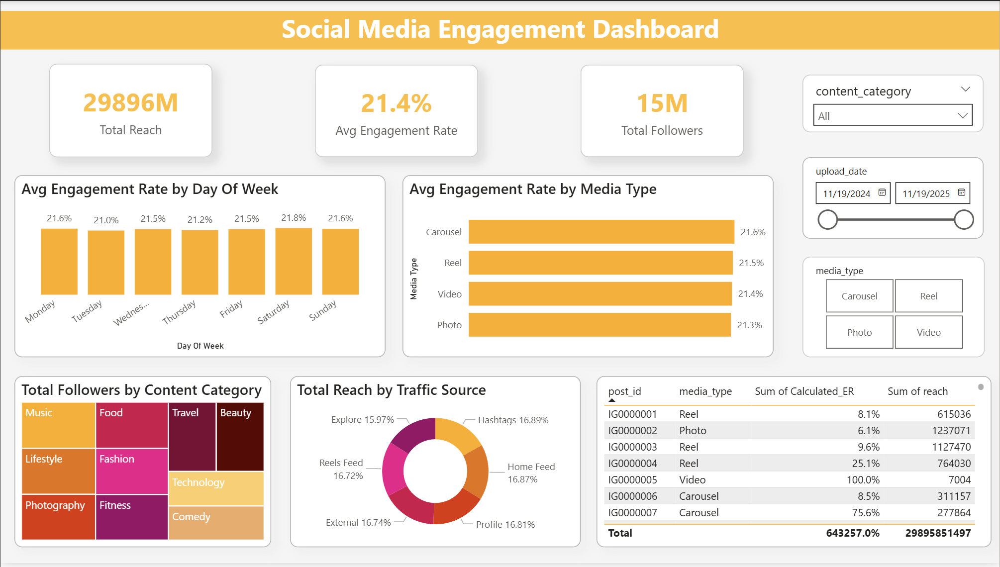

# Social Media Engagement Analysis Dashboard

## 📌 Project Overview
This project involves an end-to-end data analysis workflow, transforming a raw dataset of **30,000 social media records** into an interactive, high-performance Power BI dashboard. The objective was to track key engagement metrics, identify audience behavior patterns, and provide data-driven recommendations for content strategy optimization.

## 📊 Dashboard Preview

## 📂 Repository Structure
- **Dataset/**: Contains the original `social_media_engagement.csv`.
- **Excel_Analysis/**: The cleaned Excel workbook featuring data transformation and feature engineering.
- **PowerBI_Dashboard/**: The `.pbix` file containing the data model and interactive visuals.
- **Insights_Recommendations/**: Executive summary and strategic advice in PDF format.
- **Screenshots/**: High-resolution image of the final dashboard (`Dashboard.png`).

## 🛠️ Data Processing Workflow

### 1. Data Cleaning & Engineering (Excel)
- **Outlier Management:** Implemented a "Capped Engagement Rate" logic to ensure data integrity where engagement exceeded reach.
- **Feature Engineering:** - Extracted `Day_of_Week` from timestamps.
  - Created `Caption_Category` (Short, Medium, Long) based on character count.
  - Assigned `Day_Num` for chronological sorting in visuals.
- **Data Structuring:** Converted raw ranges into official Excel Tables for dynamic Power BI integration.

### 2. Data Modeling & DAX (Power BI)
- **Measures Created:**
  - `Total Reach`: Aggregated unique user views.
  - `Avg Engagement Rate`: Calculated as `(Likes + Comments + Shares + Saves) / Reach`.
  - `Follower Growth`: Sum of followers gained per post.
- **UI/UX Design:** Applied a custom **Solar Dark Theme** with rounded visual containers and a high-contrast color palette for executive readability.

## 💡 Key Insights
- **Optimal Timing:** Saturday is the peak engagement day, showing a significant lift compared to mid-week performance.
- **Content Format:** Reels drive the highest reach and follower growth, while Carousels lead in "Save" rates.
- **Top Categories:** 'Technology' and 'Beauty' are the most efficient niches for community building.

## 🚀 How to Use
1. Download the `Social_Media_Project_Final.pbix` file.
2. Open in **Power BI Desktop**.
3. Use the **Content Category Slicer** to filter results by specific industry niches.
4. Interact with the **Day of Week** chart to see how engagement fluctuates throughout the week.

---
**Author:** Omkar Shelke  
**Tools:** Excel, Power BI, DAX, Data Visualization
